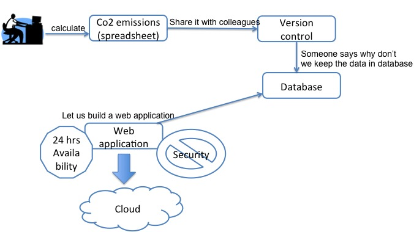

name: inverse
layout: true
class: middle, inverse

---

# Managing complexity and modular code development

## [Radovan Bast](http://bast.fr)

### [NeIC](https://neic.nordforsk.org)/ [UiT The Arctic University of Norway](https://uit.no)

Text is free to share and remix under [CC-BY-SA-4.0](https://creativecommons.org/licenses/by-sa/4.0/).

Code examples: [MIT license](http://opensource.org/licenses/mit-license.html)

Credits: [Jonas Juselius](https://github.com/juselius),
         [Roberto Di Remigio](http://totaltrash.xyz),
         [Ole Martin Bjørndalen](https://github.com/olemb)

---

layout: false

## Complexity

.left-column[

]
.right-column[
- The complexity of software is an essential property, not an accidental one [Fred Brooks].
- We start with a simple idea and overtime software grows complex.
]

---
## Software grows complex over time


- It is inherent characteristic of software to change and grow over time
- There is no silver bullet for managing complexity. However, there are some bad practices that we can avoid.

---

## The front panel: many dependencies


(c) Joe Paradiso

---

## The back side: global variables


(c) Joe Paradiso

---

## Simple vs. easy


---

## [The tar pit](http://shaffner.us/cs/papers/tarpit.pdf)

- Over time software tends to become harder and harder to reason about
- The code base easily becomes untidy ("I'll fix it later")
- Small changes become harder to implement
- Hacks and workarounds trump design
- Bugs start appearing in unexpected places
- More time is spent debugging than developing
- Complexity strangles development because it does not scale well

(Slide adapted from [Complexity in software development by Jonas Juselius](https://github.com/scisoft/complexity))

---

## Modular design is good

### Examples

- Lego
- Car manufacturing
- Design of your phone or laptop
- Modular composition when you order a laptop
- Success of USB
- Study programs

### Advantages

- Separation of concerns
- Composability
- Leveraging functionality

---

## Prefer loose coupling and high cohesion

- Strong coupling


- Loose coupling
    - Easier to reassemble
    - Easier to understand


---

## Example: tight coupling

```python
#function to check ssn format 000000-0000 is valid
def check_ssn(ssn):

    ssn_valid = True

    # check if left six characters is number
    if left_char(ssn):
        ssn_valid = True
    else:
        ssn_valid = False

    # check if right four characters is number
    if right_char(ssn):
        ssn_valid = True
    else:
        ssn_valid = False

    # if ssn is valid return user data

    if ssn_valid:
        return "SELECT NAME FROM USERS WHERE ssn_number=ssn"
    else:
        return None

def left_char(ssn):
    # do something
    return True


def right_char(ssn):
    #do something
    return True
```
---
## Example: improving bad design

```python

def check_ssn(ssn):
    if verify(ssn):
        return database_find(ssn)
    else:
        return None

def verify(ssn):
    ## do something

def database_find(ssn):
    ## do something
```
---

## Prefer loose coupling and high cohesion

- Low cohesion: difficult to maintain, test, reuse, or even understand
    - Non-cohesive code introduces unnecessary dependencies
    - Swiss army knife modules


- High cohesion: robust, reliable, reusable, understandable
    - **Do one thing only and do it well**
    - API of cohesive code changes less over time
    - Power of the Unix command line is a set of highly cohesive tools
    - Microservices


---

## Purity

- Pure functions have no notion of state: They take input values and return
  values
- Given the same input, a pure function *always* returns the same value
- Function calls can be optimized away
- Pure function == data
- Purity is key to equational reasoning


(Slide taken from [Complexity in software development by Jonas Juselius](https://github.com/scisoft/complexity))

---

## Example: pure vs. stateful

### a) pure

```python
# function which computes the body mass index
def get_bmi(mass_kg, height_m):
    return mass_kg/(height_m**2)

# compute the body mass index
bmi = get_bmi(mass_kg=90.0, height_m=1.91))
```

### b) stateful

```python
mass_kg = 90.0
height_m = 1.91
bmi = 0.0

# function which computes the body mass index
def get_bmi():
    global bmi
    bmi = mass_kg/(height_m**2)

# compute the body mass index
get_bmi()
```

---

## Enemy of the state

.left-column[

]
.right-column[
### Strive for pure functions, fear the state

- Pure functions do not have side effects
- Side effects lead to bugs and increase complexity
- Pure functions are easy to
    - Test
    - Understand
    - Reuse
    - Parallelize
    - Simplify
    - Refactor
    - Optimize

### But we need to deal with state somewhere

- Examples later in this talk
]

---

## Equational reasoning

- We start with a function:
  $$ f(x) $$
- We wish to evaluate this:
  $$ y = f(a) + f(b) \times [f(c) - f(c)] $$
- We can simplify:
  $$ y = f(a) + f(b) \times 0 $$
  $$ y = f(a) $$
- Another example:
  $$ z = f(a) + f(b) + f(c) + f(d) $$
- We know we can rearrange (important for concurrency):
  $$ z = f(b) + f(d) + f(c) + f(a) $$

---

## Concurrency

- Concurrency in imperative code is very hard
- You are totally lost in the dark without a good thread checker
- In a pure, immutable world concurrency is nearly trivial!
- Prefer immutable data to mutable data


(Slide taken from [Complexity in software development by Jonas Juselius](https://github.com/scisoft/complexity))

---

## Composition

- Build complex behavior from simple components
- We can reason about the components and the composite
- Composition is key to managing complexity
- Modularity does not imply simplicity, but is enabled by it


(Slide taken from [Complexity in software development by Jonas Juselius](https://github.com/scisoft/complexity))

---

## One way to look at your code


- The main function calls other functions

---

## Another way to look at your code


- The main function ("program" in Fortran) is on the outside shell

---

## Recommendations

- Keep I/O on the outside and connected (examples later)
- Always read/write on the outside and pass data
- Do not read/write deep down inside the code
- Keep the inside of your code pure/stateless
- Move all the state to the outside of your code
- Keep the stateful outside shell thin
- Unit test the inside
- Regression test the shell


---

template: inverse

## Recommendations
---
## Refinement
- When we write papers we write several drafts
- While developing software, we also need to do continuous refinement
- Duplication in software is always abad idea
---

## Divide and conquer

- Split the code up
- Construct your program from parts:
  - functions
  - modules
  - packages (Python) or libraries (C or or C++ or Fortran)

## Functions, functions, functions

- Build your code from functions
- Break your code down to more functions
  - if you have too many levels of indentation
  - if a function gets too long
  - if a function does more than one thing
  - if you find it hard to name a function
- A function that performs a single operation is simpler to
  understand, test, and reuse
- A function that does not fit on one screen is too long

---

## C interface for libraries

- English is to humans what C is to programs
- C is the common language
- Basically any language can talk to a C interface
- **Create a C interface for your code**
- Better than Fortran interface (the latter imposes compilation
  order and introduces compiler dependence)

### Core language

- Core language can be any language that can export a C API
- For single-core high-performance use C or C++ or Fortran
- With an eccentric language you risk to reduce the number of contributors

### Communicate through memory or through files?

- Through memory is more general than through files

---

## Import and export

- Import only the functionality that you need
- Import only where you need it
- Export as little functionality as possible

## Naming things

- Use meaningful names
- Indent
- Use standard naming conventions
- Python: use [PEP8](https://www.python.org/dev/peps/pep-0008/)
- Write comments in English

```
Makecodee
asytoread
```

---

## Encapsulation

- Hide internals by language or by convention (header file in C/C++,
  public/private in Fortran, underscores in Python)
- "Python has no locked doors; it's a consenting adults language.
  If you open the door you're responsible for what you see." [R. Hettinger]
- Expose the "what", hide the "how"

## Documentation

- Separate the "what it can do" from "how is it implemented"
- Document your API
- Version your API ([semantic](http://semver.org) or [sentimental](http://sentimentalversioning.org)
  or [romantic](https://github.com/jashkenas/backbone/issues/2888#issuecomment-29076249) versioning)

---

## Modules testable on its own

- Sharpens interfaces
- Once you start testing your library you really see the coupling and cohesion
- Increases development speed

## Libraries built on its own

- Prerequisite for testable on its own

## Libraries have own development history

- Decouple the development history
- Each unit should have its own Git history/repository

---

## Recommendations for C++

(thanks to [Roberto Di Remigio](http://totaltrash.xyz) for this list)

- Read [CppCoreGuidelines](http://isocpp.github.io/CppCoreGuidelines/CppCoreGuidelines).
- Use C++11 and show the finger to obsolete compilers.
- Use CMake >= 3.2 as build system to enforce strict standard compliance of
  your code. Bonus: you can use C++14 whenever possible and have safe fallbacks.
- Consider very carefully whether you want to depend on the Boost library.
- Do not use C constructs in C++ code.
- Know the STL, 'cause the STL is your friend and will always be.
- Use algorithms from the <algorithm> header whenever possible.
- Use functional constructs from the <functional> header whenever possible.
- Use tuples for multiple return values whenever it makes sense (avoid doing
  pointer and/or reference tricks to get more stuff out of a function because it
  will mess up your head).
- Use Doxygen. Even just Doxygen-style comments are fine.

---

## Simplicity and clarity before elegance before efficiency

### Avoid premature optimization

- Do not optimize
- If you have to optimize, optimize later
- If you have to optimize, measure, do not guess

### Simple is better than complex

- If you cannot understand or explain a function on a cold gray Monday morning before coffee, it is too complex. (Quote adapted from [Pieter Hintjens, Social Architecture, 2009](https://www.gitbook.com/book/hintjens/social-architecture/details))

---

## More recommendations

- Introduce code reading sessions in your group
- Read sources written by others
- Apply [YAGNI](https://en.wikipedia.org/wiki/You_aren't_gonna_need_it) principle
- Do not postpone to run time what can be done well at compile time

---

template: inverse

## Quiz

### Decide which alternative you like better and discuss why

---

## Main function vs. global scope in Python

### a) main function

```python
def do_something(input):
    # ...
    return something

def main():
    result = do_something(2.0)
    print(result)

if __name__ == '__main__':
    main()
```

### b) global scope

```python
def do_something(input):
    # ...
    return something

result = do_something(2.0)
print(result)
```

---

## Pure attribute in Fortran

### a) default

```fortran
function my_function(a, b)
    ! ... function that happens to have no side effects
end function

subroutine my_subroutine(a, b, c)
    ! ... subroutine that happens to have no side effects
end subroutine
```

### b) with "pure" attribute

```fortran
pure function my_function(a, b)
    ! ... function body unchanged
end function

pure subroutine my_subroutine(a, b, c)
    ! ... subroutine body unchanged
end subroutine
```

---

## Argument vs. global input (example: R)

### a) "offset" passed as argument

```r
factor_and_offset1 <- function (x, factor, offset) {
    x*factor + offset
}

a <- factor_and_offset1(2.0, 3.0, 4.0)
```

### b) "offset" defined in outer scope

```r
offset <- 4.0

factor_and_offset2 <- function (x, factor) {
    x*factor + offset
}

a <- factor_and_offset2(2.0, 3.0)
```

---

## Explicit interface vs. invisible dependencies (C++)

(example taken from [CppCoreGuidelines](http://isocpp.github.io/CppCoreGuidelines/CppCoreGuidelines#a-nameri-explicitai1-make-interfaces-explicit))

### a)

```cpp
int rnd(double d)
{
    return (rnd_up) ? ceil(d) : d;
}
```

### b)

```cpp
int rnd(double d, bool rnd_up)
{
    return (rnd_up) ? ceil(d) : d;
}
```

---

## Constructor vs. explicit vs. intrinsic in Fortran

### a) array constructor

```fortran
result = (/(vector(i)*factor + offset, i = 1, size(vector))/)
```

### b) explicit

```fortran
do i = 1, size(vector)
    result(i) = vector(i)*factor + offset
end do
```

### c) intrinsic array operation

```fortran
result = vector*factor + offset
```

---

## Implicit vs. implicit none in Fortran

### a) implicit

```fortran
dmass = 2.0d0
acceleration = 3.0d0

force = dmass*acceleration
```

### b) implicit none

```fortran
implicit none

real(8) :: mass
real(8) :: acceleration
real(8) :: force

mass = 2.0d0
acceleration = 3.0d0

force = mass*acceleration
```

---

## Variable reuse

### a) reuse memory

```fortran
integer, parameter :: length = 1000000
real(8) :: distances(length)

call get_distances(distances)
call do_something(distances)

! now we do not need distances anymore, we can safely reuse the array
call get_angles(distances)
call do_something_else(distances)
```

### b) allocate twice the memory

```fortran
integer, parameter :: length = 1000000
real(8) :: distances(length)
real(8) :: angles(length)

call get_distances(distances)
call do_something(distances)

call get_angles(angles)
call do_something_else(angles)
```

---

## Ternary operator

### a) ternary

```python
i = 1 if is_odd else 2  # python
```

```fortran
i = merge(1, 2, is_odd)  ! fortran
```

```cpp
int i = (is_odd) ? 1 : 2;  // C++
```

### b) explicit

```python
# python
if is_odd:
    i = 1
else:
    i = 2
```

Similar for Fortran and C++.

---

## Implicit vs. named arguments

### a) implicit

```python
bmi = get_bmi(90.0, 1.91)
```

### b) named

```python
bmi = get_bmi(mass_kg=90.0, height_m=1.91)
```

---

## File I/O (example: Python)

### a) pass file name

```python
# parse_input1 function opens and reads the file
result = parse_input1(file_name)
```

### b) pass file handle

```python
with open(file_name, 'r') as f:
    # parse_input2 reads the file
    result = parse_input2(f)
```

### c) pass data

```python
with open(file_name, 'r') as f:
    input_lines = f.readlines()
    # parse_input3 does not know anything about the file
    result = parse_input3(input_lines)
```

---

## Private vs. public (Fortran)

### a) default is private

```fortran
module mymodule
    implicit none
    public myroutine  ! added these
    private           ! two lines
contains
    subroutine myroutine()
    ...
    end subroutine
end module
```

### b) default is public

```fortran
module mymodule
    implicit none
contains
    subroutine myroutine()
    ...
    end subroutine
end module
```

---

## Generic vs. function import

### a) generic

```python
import somelib  # python
```

```fortran
use somelib  ! fortran
```

### b) function import

```python
from somelib import this, that
```

```fortran
use somelib, only: this, that
```

---

## Module-level vs. function-level import (Python or Fortran)

### a) module-level

```python
from somelib import somefunction

def myfunction(a, b, c):
    # use somefunction
    return something
```

### b) function-level

```python
def myfunction(a, b, c):
    from somelib import somefunction
    # use somefunction
    return something
```

---

## Intent vs. unspecified

### a) intent specified

```fortran
subroutine do_something(a, b, c, d)
    real(8), intent(in)    :: a
    logical, intent(in)    :: b
    real(8), intent(inout) :: c
    real(8), intent(out)   :: d

    ! ...
end subroutine
```

### b) intent unspecified

```fortran
subroutine do_something(a, b, c, d)
    real(8) :: a
    logical :: b
    real(8) :: c
    real(8) :: d

    ! ...
end subroutine
```

---

## Loop vs. map/filter

### a) loop

```python
numbers = [1, 2, 3, 4, 5]

squares = []
for number in numbers:
    squares.append(number**2)

odds = []
for number in numbers:
    if number%2 == 1:
        odds.append(number)
```

### b) map and filter

```python
numbers = [1, 2, 3, 4, 5]

squares = map(lambda x: x**2, numbers)
odds = filter(lambda x: x%2 == 1, numbers)
```

---

## Conditionals vs. higher-order function

### a) conditionals

```python
def apply(x, option_a=False, option_b=False):
    parameter = 137
    if option_a:
        return complicated_function_a(x, parameter)
    elif option_b:
        return complicated_function_b(x, parameter)
    else
        # FIXME we should stop here
        pass

apply(2.0, option_a=True)
```

### b) higher-order function

```python
def apply(x, f):
    parameter = 137
    return f(x, parameter)

apply(2.0, complicated_function_a)
```

---

### a) class

```python
class Pet:
    def __init__(self, name):
        self.name = name
        self.hunger = 0
    def go_for_a_walk(self):
        self.hunger += 1

my_cat = Pet('Tom')
my_cat.go_for_a_walk()
print(my_cat.hunger)
```

### vs. b) named tuple (in Python)

```python
from collections import namedtuple

def go_for_a_walk(pet):
    new_hunger = pet.hunger + 1
    return pet._replace(hunger=new_hunger)

Pet = namedtuple('Pet', ['name', 'hunger'])

my_cat = Pet(name='Tom', hunger=0)
my_cat = go_for_a_walk(my_cat)
print(my_cat.hunger)
```

---

## Conclusions

- Modular and well structured code is easy to test
- Entangled code is difficult to test
- Introduce testing early - it will **automatically guide you towards a modular and well structured code**
- Compose your code out of **pure functions**
- Prefer immutable data structures, do not overuse classes
